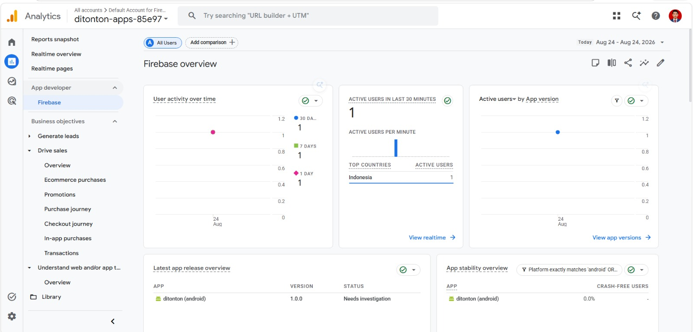
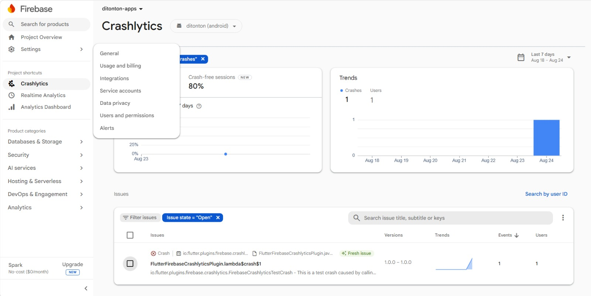

# Ditonton — Flutter Expert Submission


Ditonton adalah aplikasi **Movie & TV Series** menggunakan data dari API [The Movie Database (TMDB)](https://www.themoviedb.org/), dikembangkan sebagai submission pada kelas Multi-Platform App Developer **Menjadi Flutter Developer Expert — Dicoding Indonesia**.

Repository ini merupakan pengembangan lanjutan dari starter project di kelas ini, dengan penambahan fitur TV Series, migrasi state management ke BLoC,Menerapkan SSL Pinning, Firebase Analytics & Crashlytics , serta Continuous Integration dengan Github Action.

---

## ✨ Fitur

- **Halaman Movie & TV Series** — Now Playing/On The Air, Popular, dan Top Rated, masing-masing punya halaman tersendiri
- **Detail Movie & TV Series** — poster, rating, sinopsis, genre, serta rekomendasi tontonan serupa
- **Pencarian reaktif** — hasil pencarian muncul otomatis saat mengetik (dengan debounce, tanpa perlu menekan tombol submit)
- **Watchlist lokal** — simpan Movie/TV series yang ingin ditonton, tersimpan permanen menggunakan SQLite meski aplikasi ditutup
- **Navigasi modern** — Bottom Navigation Bar (Home, Watchlist, About) dengan Tab Movies/TV Series yang dapat di-swipe

---

## 🏗️ Arsitektur & Tech Stack

| Layer/Aspek | Teknologi |
|---|---|
| Arsitektur | Clean Architecture (Domain – Data – Presentation) |
| State Management | [flutter_bloc](https://pub.dev/packages/flutter_bloc) (BLoC pattern, migrasi dari Provider) |
| Dependency Injection | [get_it](https://pub.dev/packages/get_it) |
| Networking | [http](https://pub.dev/packages/http) dengan **SSL Pinning** |
| Local Storage | [sqflite](https://pub.dev/packages/sqflite) |
| Functional Error Handling | [dartz](https://pub.dev/packages/dartz) (`Either`) |
| Monitoring | Firebase Analytics & Crashlytics |
| Testing | flutter_test, mockito, bloc_test |
| CI/CD | GitHub Actions |

---

## 🔒 SSL Pinning

Aplikasi ini menerapkan **SSL Pinning** ke API TMDB (`api.themoviedb.org`). Ini menjadi lapisan keamanan tambahan terhadap potensi serangan Man-in-the-Middle (MITM).

---

## 📊 Firebase Analytics & Crashlytics

Aplikasi terintegrasi dengan **Firebase Analytics**

**Screenshot Analytics:**



**Screenshot Crashlytics:**



---

## ⚙️ Continuous Integration

Setiap kali ada push atau pull request ke branch `main`, GitHub Actions otomatis menjalankan:
1. **Analisis kode** (`flutter analyze`) dan pengecekan format (`dart format`)
2. **Seluruh automated test** (`flutter test --coverage`)

Konfigurasi workflow dapat dilihat di [`.github/workflows/flutter_ci.yml`](.github/workflows/flutter_ci.yml). Status build terkini ditampilkan pada badge di bagian atas README ini.

---

## 🧪 Testing & Coverage

Project ini memiliki automated test di seluruh layer (Domain, Data, dan Presentation/BLoC) dengan **coverage di atas 70%** (dijalankan otomatis lewat CI).

Untuk menjalankan test secara lokal beserta laporan coverage:

```bash
flutter test --coverage
```

Laporan awal akan tersimpan di `coverage/lcov.info`. Untuk melihat laporan dalam bentuk persentase.

```bash
python check_coverage.py
```

---

## 📁 Struktur Proyek

```
ditonton/
├── core/                        # modul shared/generic
│   └── lib/
│       ├── common/              # constants, exception, failure, state_enum, ssl pinning client
│       ├── domain/entities/     # genre
│       ├── data/models/         # genre_model
│       └── presentation/widgets/ # sub_heading
│
├── movie/                       # modul fitur movie (self-contained)
│   └── lib/
│       ├── domain/               # entities, repository interface, use cases
│       ├── data/                 # models, data sources, movie_database_helper, repository impl
│       └── presentation/
│           ├── bloc/             # 7 bloc (list, detail, search, popular, top_rated, now_playing, watchlist)
│           ├── pages/            # halaman UI movie
│           └── widgets/          # movie_card, movie_list
│
├── tv_series/                   # modul fitur tv series (self-contained, mirror dari movie/)
│   └── lib/
│       ├── domain/
│       ├── data/
│       └── presentation/
│           ├── bloc/             # 7 bloc
│           ├── pages/
│           └── widgets/
│
├── lib/                          # app utama (wiring & halaman gabungan)
│   ├── presentation/pages/       # main_page, home_page, watchlist_page, about_page
│   ├── injection.dart            # dependency injection (menggabungkan core + movie + tv_series)
│   └── main.dart
│
└── pubspec.yaml                  # dependency ke core/movie/tv_series via path
```


---

## 🚀 Menjalankan Proyek

```bash
flutter pub get
flutter run
```

Pastikan environment sudah sesuai dengan `pubspec.yaml` , serta konfigurasi Firebase (`google-services.json` dan `firebase_options.dart`) sudah tersedia.
